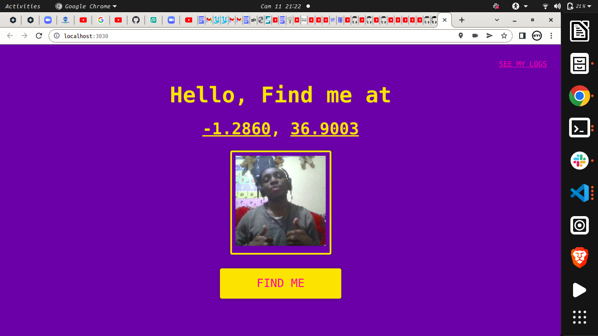

### Coordinates Tracker using selfie App
    This is a little web application that allows you to submit an image of your self along with your geolocation. This app is a nice starting point for          other self-tracking applications or just a standalone application to create a collection of "dataselfies" with some extra metadata.




## Setup

In your terminal:
```sh
npm install
```

then start your server
```sh
npm start
```
or `npm run dev`

Go to: `localhost:3030` to see the magic.


